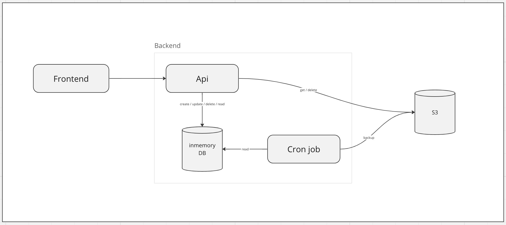

# Infra

## Database

個人だとDBのランニングコストは高すぎたので、MySQL+Flywayではなくてh2(inmemory)にした。
サーバ止まることも想定して、S3にバックアップ取るフローを考える。

docker-composeでMySQL+Flywayで動作することは、`tiori/docker/compose.yml`と`org.springframework.boot:spring-boot-docker-compose`in build.gradleで、localにおいて試して確認済み
